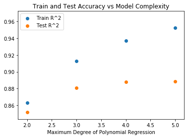

# Midterm Practice: Predicting Boston Home Values

In this lab, we are predicting the natural log of the sum of all transactions per user. This is a great chance to practice all of our skills to date in order to create a regression model.
  
# Variable Descriptions

This data frame contains the following columns:

#### crim  
per capita crime rate by town.

#### zn  
proportion of residential land zoned for lots over 25,000 sq.ft.

#### indus  
proportion of non-retail business acres per town.

#### chas  
Charles River dummy variable (= 1 if tract bounds river; 0 otherwise).

#### nox  
nitrogen oxides concentration (parts per 10 million).

#### rm  
average number of rooms per dwelling.

#### age  
proportion of owner-occupied units built prior to 1940.

#### dis  
weighted mean of distances to five Boston employment centres.

#### rad  
index of accessibility to radial highways.

#### tax  
full-value property-tax rate per $10,000.

#### ptratio  
pupil-teacher ratio by town.

#### black  
1000(Bk - 0.63)^2 where Bk is the proportion of blacks by town.

#### lstat  
lower status of the population (percent).

#### medv  
median value of owner-occupied homes in $10000s.
  
  
  
Source
Harrison, D. and Rubinfeld, D.L. (1978) Hedonic prices and the demand for clean air. J. Environ. Economics and Management 5, 81–102.

Belsley D.A., Kuh, E. and Welsch, R.E. (1980) Regression Diagnostics. Identifying Influential Data and Sources of Collinearity. New York: Wiley.

# Import Data


```python
import pandas as pd
from sklearn.model_selection import train_test_split
from sklearn.linear_model import LinearRegression, Lasso, LassoCV, Ridge, RidgeCV
from sklearn.metrics import mean_squared_error
```


```python
df = pd.read_csv('train.csv')
print(len(df))
df.head()
```

    333


<div>
<style>
    .dataframe thead tr:only-child th {
        text-align: right;
    }

    .dataframe thead th {
        text-align: left;
    }

    .dataframe tbody tr th {
        vertical-align: top;
    }
</style>
<table border="1" class="dataframe">
  <thead>
    <tr style="text-align: right;">
      <th></th>
      <th>ID</th>
      <th>crim</th>
      <th>zn</th>
      <th>indus</th>
      <th>chas</th>
      <th>nox</th>
      <th>rm</th>
      <th>age</th>
      <th>dis</th>
      <th>rad</th>
      <th>tax</th>
      <th>ptratio</th>
      <th>black</th>
      <th>lstat</th>
      <th>medv</th>
    </tr>
  </thead>
  <tbody>
    <tr>
      <th>0</th>
      <td>1</td>
      <td>0.00632</td>
      <td>18.0</td>
      <td>2.31</td>
      <td>0</td>
      <td>0.538</td>
      <td>6.575</td>
      <td>65.2</td>
      <td>4.0900</td>
      <td>1</td>
      <td>296</td>
      <td>15.3</td>
      <td>396.90</td>
      <td>4.98</td>
      <td>24.0</td>
    </tr>
    <tr>
      <th>1</th>
      <td>2</td>
      <td>0.02731</td>
      <td>0.0</td>
      <td>7.07</td>
      <td>0</td>
      <td>0.469</td>
      <td>6.421</td>
      <td>78.9</td>
      <td>4.9671</td>
      <td>2</td>
      <td>242</td>
      <td>17.8</td>
      <td>396.90</td>
      <td>9.14</td>
      <td>21.6</td>
    </tr>
    <tr>
      <th>2</th>
      <td>4</td>
      <td>0.03237</td>
      <td>0.0</td>
      <td>2.18</td>
      <td>0</td>
      <td>0.458</td>
      <td>6.998</td>
      <td>45.8</td>
      <td>6.0622</td>
      <td>3</td>
      <td>222</td>
      <td>18.7</td>
      <td>394.63</td>
      <td>2.94</td>
      <td>33.4</td>
    </tr>
    <tr>
      <th>3</th>
      <td>5</td>
      <td>0.06905</td>
      <td>0.0</td>
      <td>2.18</td>
      <td>0</td>
      <td>0.458</td>
      <td>7.147</td>
      <td>54.2</td>
      <td>6.0622</td>
      <td>3</td>
      <td>222</td>
      <td>18.7</td>
      <td>396.90</td>
      <td>5.33</td>
      <td>36.2</td>
    </tr>
    <tr>
      <th>4</th>
      <td>7</td>
      <td>0.08829</td>
      <td>12.5</td>
      <td>7.87</td>
      <td>0</td>
      <td>0.524</td>
      <td>6.012</td>
      <td>66.6</td>
      <td>5.5605</td>
      <td>5</td>
      <td>311</td>
      <td>15.2</td>
      <td>395.60</td>
      <td>12.43</td>
      <td>22.9</td>
    </tr>
  </tbody>
</table>
</div>


# Define Variables, Create an Initial Model and Measuring Model Performance


```python
X = df.drop('medv', axis=1)
y = df.medv
X_train, X_test, y_train, y_test = train_test_split(X, y)
models = [LinearRegression(), Lasso(), Ridge()]
names = ['OLS', 'Lasso', 'Ridge']
for model, name in list(zip(models, names)):
    model.fit(X_train, y_train)
    y_hat_train = model.predict(X_train)
    y_hat_test = model.predict(X_test) 
    print('Model Stats for: {}'.format(name))
    print('Train R^2:', model.score(X_train, y_train))
    print('Test R^2:', model.score(X_test, y_test))
    print('Training MSE: {}'.format(mean_squared_error(y_train, y_hat_train)))
    print('Testing MSE: {}'.format(mean_squared_error(y_test, y_hat_test)))
    print('\n')    
```

    Model Stats for: OLS
    Train R^2: 0.758054273425
    Test R^2: 0.589806314045
    Training MSE: 22.185666473395543
    Testing MSE: 23.82839479870425
    
    
    Model Stats for: Lasso
    Train R^2: 0.702894743674
    Test R^2: 0.597970726305
    Training MSE: 27.243622847308835
    Testing MSE: 23.35411924228334
    
    
    Model Stats for: Ridge
    Train R^2: 0.756348622343
    Test R^2: 0.576741606714
    Training MSE: 22.342069343395092
    Testing MSE: 24.587331405646232
    
    


# Using Cross Validation


```python
model = LassoCV()
model.fit(X_train, y_train)
y_hat_train = model.predict(X_train)
y_hat_test = model.predict(X_test) 
print('Model Stats for: {}'.format('LassoCV'))
print('Train R^2:', model.score(X_train, y_train))
print('Test R^2:', model.score(X_test, y_test))
print('Training MSE: {}'.format(mean_squared_error(y_train, y_hat_train)))
print('Testing MSE: {}'.format(mean_squared_error(y_test, y_hat_test)))
print('Model details:', model)
print('\n')    
```

    Model Stats for: LassoCV
    Train R^2: 0.721750092652
    Test R^2: 0.596327463172
    Training MSE: 25.514646313709015
    Testing MSE: 23.44957737352332
    Model details: LassoCV(alphas=None, copy_X=True, cv=None, eps=0.001, fit_intercept=True,
        max_iter=1000, n_alphas=100, n_jobs=1, normalize=False, positive=False,
        precompute='auto', random_state=None, selection='cyclic', tol=0.0001,
        verbose=False)
    
    


```python
model.alpha_
```


    0.71924211867550536


```python
model = RidgeCV()
model.fit(X_train, y_train)
y_hat_train = model.predict(X_train)
y_hat_test = model.predict(X_test) 
print('Model Stats for: {}'.format('RidgeCV'))
print('Train R^2:', model.score(X_train, y_train))
print('Test R^2:', model.score(X_test, y_test))
print('Training MSE: {}'.format(mean_squared_error(y_train, y_hat_train)))
print('Testing MSE: {}'.format(mean_squared_error(y_test, y_hat_test)))
print('Model details:', model)
print('\n')    
```

    Model Stats for: RidgeCV
    Train R^2: 0.757976640872
    Test R^2: 0.587401715281
    Training MSE: 22.192785135723614
    Testing MSE: 23.96807936877122
    Model details: RidgeCV(alphas=(0.1, 1.0, 10.0), cv=None, fit_intercept=True, gcv_mode=None,
        normalize=False, scoring=None, store_cv_values=False)
    
    


```python
model.alpha_
```


    0.10000000000000001


# Feature Engineering + Refinements


```python
import pandas as pd
import matplotlib.pyplot as plt
import numpy as np
from sklearn.linear_model import Ridge
from sklearn.preprocessing import PolynomialFeatures
from sklearn.pipeline import make_pipeline
import seaborn as sns
%matplotlib inline
```


```python
#Fill Null Values and Normalize
for col in X.columns:
    avg = X[col].mean()
    X[col] = X[col].fillna(value=avg)
    minimum = X[col].min()
    maximum = X[col].max()
    range_ = maximum - minimum
    X[col] = X[col].map(lambda x: (x-minimum)/range_)

# Test/train split
X_train, X_test, y_train, y_test = train_test_split(X, y)

# Make a pipeline model with polynomial transformation
#Currently with basic ridge.
#Could use and LASSO regression with cross-validation, (included in comments)
degree_min = 2
degree_max=5

degrees = []
train_errs = []
test_errs = []
for degree in range(degree_min,degree_max+1):
    model = make_pipeline(PolynomialFeatures(degree, interaction_only=False),
                          Ridge()
                         )
    #Could replace Ridge() above with a more complicated cross validation method to improve tuning
    #using a cross validation method will substantially increase runtime
    model.fit(X_train,y_train)
    #Get r^2 values for testing predictions and training predictions
    test_score = model.score(X_test,y_test)
    test_errs.append(test_score)
    
    train_score = model.score(X_train,y_train)
    train_errs.append(train_score)
    
    degrees.append(degree)
#Create Plot
plt.scatter(degrees, train_errs, label='Train R^2')
plt.scatter(degrees, test_errs, label='Test R^2')
plt.title('Train and Test Accuracy vs Model Complexity')
plt.xlabel('Maximum Degree of Polynomial Regression')
plt.legend()
```


    <matplotlib.legend.Legend at 0x264525ed710>





# Comment:

While training accuracy continues to improve with model complexity, we see diminished returns after degree 3 leading us to believe the model is overfit past that point. As such, we will try and finalize our model using a polynomial of degree3.


```python
model = make_pipeline(PolynomialFeatures(3, interaction_only=False),
                          Ridge()
                         )
#Could replace Ridge() above with a more complicated cross validation method to improve tuning
#using a cross validation method will substantially increase runtime
model.fit(X_train,y_train)
test_score = model.score(X_test,y_test)
print('R^2 Test:', test_score)
train_score = model.score(X_train,y_train)
print('R^2 Train:', train_score)
y_hat_train = model.predict(X_train)
y_hat_test = model.predict(X_test) 
print('Model Stats for: {}'.format('LassoCV'))
print('Training MSE: {}'.format(mean_squared_error(y_train, y_hat_train)))
print('Testing MSE: {}'.format(mean_squared_error(y_test, y_hat_test)))
print('Model details:', model)
print('\n')    
```

    R^2 Test: 0.880946692601
    R^2 Train: 0.912530889575
    Model Stats for: LassoCV
    Training MSE: 7.745842740241759
    Testing MSE: 8.257271488476025
    Model details: Pipeline(memory=None,
         steps=[('polynomialfeatures', PolynomialFeatures(degree=3, include_bias=True, interaction_only=False)), ('ridge', Ridge(alpha=1.0, copy_X=True, fit_intercept=True, max_iter=None,
       normalize=False, random_state=None, solver='auto', tol=0.001))])
    
    


# Additional Notes / Comments
Much more work could still be done. Building a model is an ongoing process of refinement and is often terminated early due to time constraints or satisfaction with the model results. 

https://www.kaggle.com/c/boston-housing


```python

```
